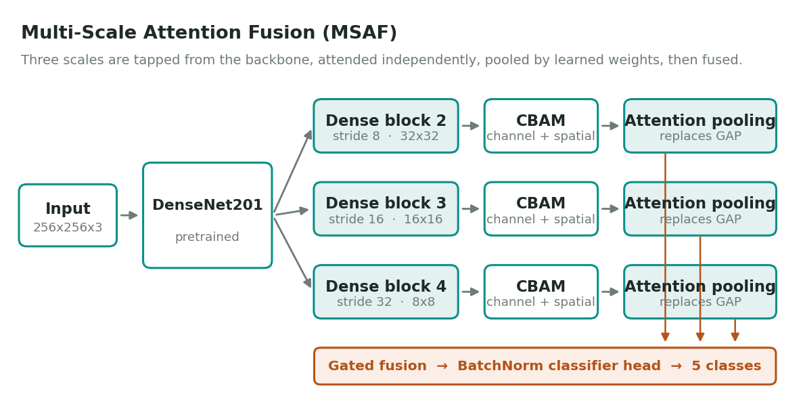
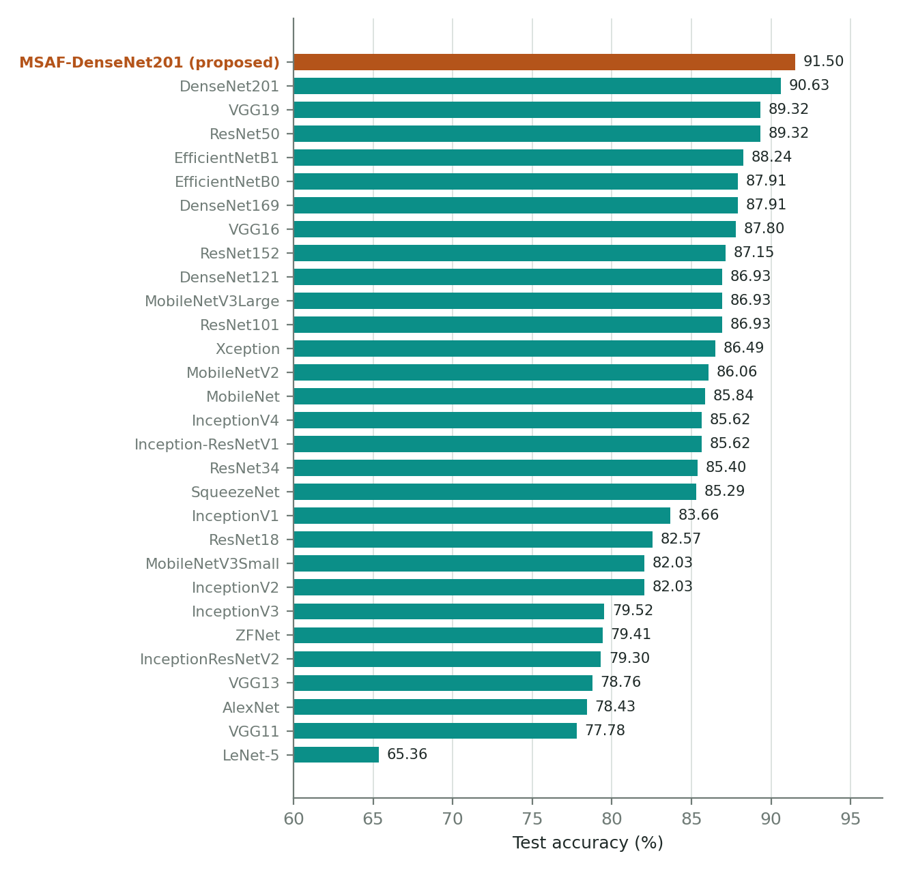
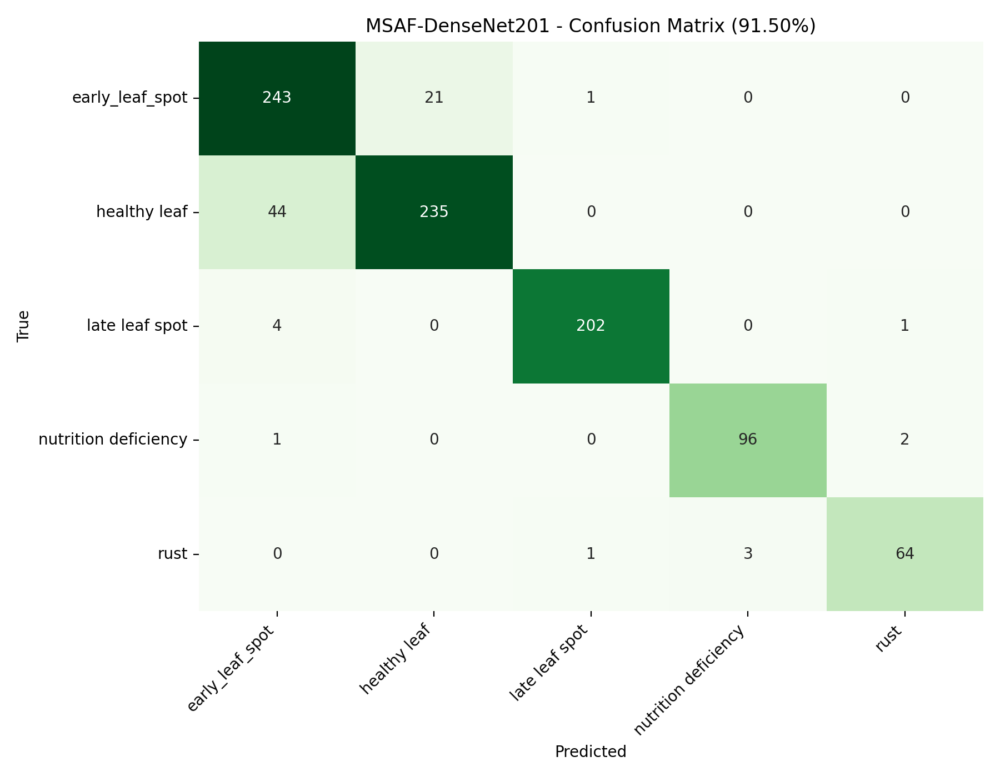
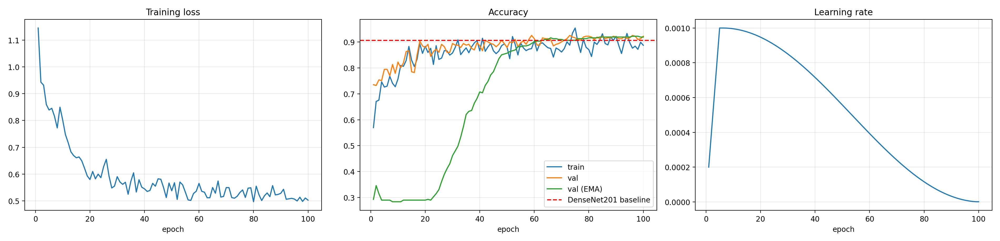
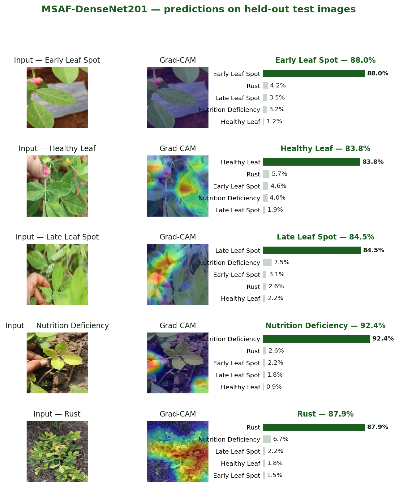
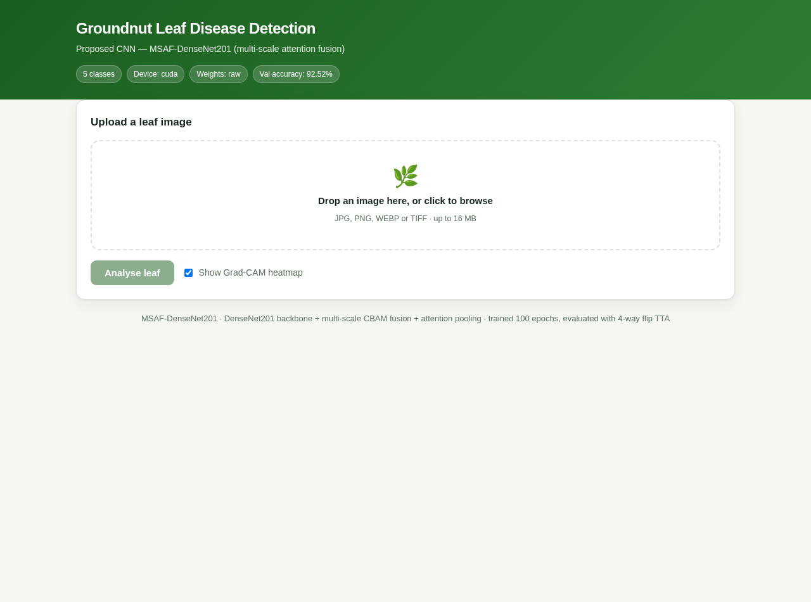
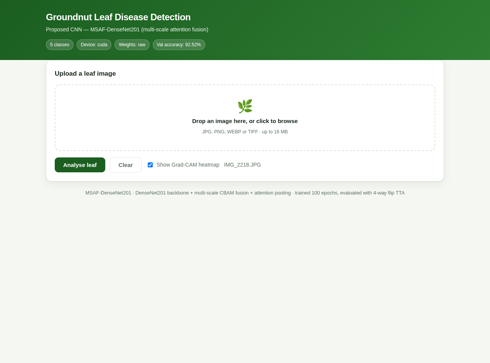
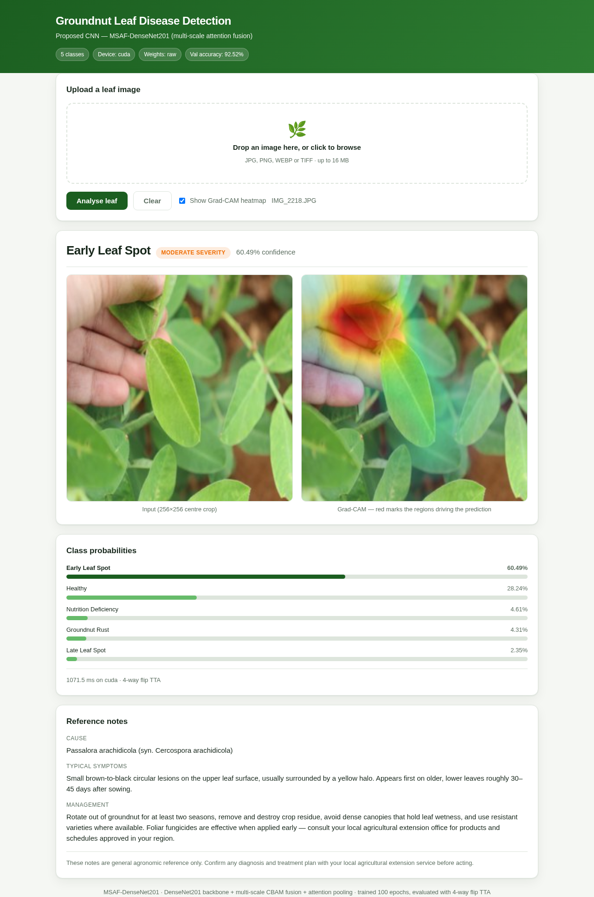

# MSAF-DenseNet201 — Groundnut Leaf Disease Classification

**Multi-Scale Attention Fusion over a DenseNet201 backbone**, designed from an error analysis of the best of 29 benchmarked CNNs.
It classifies a field photograph of a groundnut (*Arachis hypogaea*) leaf into one of five conditions and explains each prediction with a Grad-CAM heatmap.

<p>


</p>

| | |
|---|---|
| **Test accuracy** | **91.50 %** on a held-out set of 918 images, ranked 1st of 30 models |
| **Cohen's κ** | **0.8877** (best baseline, DenseNet201: 0.8760) |
| **Macro F1 / ROC-AUC** | 93.04 % / 0.989 |
| **Classes** | early leaf spot · late leaf spot · rust · nutrition deficiency · healthy leaf |
| **Deployment** | Flask web app and JSON API with Grad-CAM, under 1 s per image on a GPU |

Research internship project at **ICAR-National Institute of Veterinary Epidemiology and Disease Informatics (ICAR-NIVEDI), Bengaluru**, May–August 2026, under the supervision of Dr. K. P. Suresh.

---

## Why this model exists

Twenty-nine established CNNs were trained and tested under one protocol on the same data split. **DenseNet201** was the strongest, at 90.63 %. Its errors were not spread evenly: **early leaf spot** had the weakest recall of the five classes, and most of those mistakes were predicted as **healthy leaf**.

Two properties of the stock network explain this:

1. **Resolution.** At a 256×256 input, DenseNet201's final feature map is **8×8**. Each cell summarises a 32×32-pixel patch, so an early lesion a few pixels across never becomes a distinct feature.
2. **Pooling.** Global average pooling weights all **64** positions equally. The few cells that do respond to a lesion are diluted by the many that see healthy tissue.

MSAF-DenseNet201 changes exactly those two things:

| Weakness in DenseNet201 | Change in MSAF-DenseNet201 |
|---|---|
| Final 8×8 map is too coarse for small lesions | **Multi-scale taps** from dense blocks 2, 3 and 4 (strides 8/16/32 → 32×32, 16×16, 8×8) |
| Every channel and position treated as equally important | **CBAM** channel and spatial attention on each scale |
| GAP divides a small lesion signal by 64 | **Learned attention pooling**: a softmax weight per position, concatenated with GAP for context |

The three scale embeddings are fused and passed to a batch-normalised MLP head.
The model has **20.0 M parameters**, 1.9 M (about 10 %) more than DenseNet201 (18.1 M). For comparison, VGG19 has roughly seven times as many parameters and scores lower.

<p align="center"></p>

---

## Results

All 30 models were evaluated on **the same 918-image held-out test set** with identical metrics. The proposed model uses 4-way flip test-time augmentation (TTA).

| Rank | Model | Accuracy | Precision (w) | Recall (w) | F1 (w) | Cohen's κ |
|---:|---|---:|---:|---:|---:|---:|
| **1** | **MSAF-DenseNet201 (proposed)** | **91.50 %** | **91.78 %** | **91.50 %** | **91.53 %** | **0.8877** |
| 2 | DenseNet201 | 90.63 % | 90.73 % | 90.63 % | 90.66 % | 0.8760 |
| 3 | VGG19 | 89.32 % | 89.47 % | 89.32 % | 89.32 % | 0.8585 |
| 4 | ResNet50 | 89.32 % | 89.68 % | 89.32 % | 89.30 % | 0.8583 |
| 5 | EfficientNetB1 | 88.24 % | 88.72 % | 88.24 % | 88.24 % | 0.8446 |
| … | *25 more* | | | | | |
| 30 | LeNet-5 | 65.36 % | 66.03 % | 65.36 % | 65.56 % | 0.5385 |

The full ranking is in [`results/Final_30_Model_Ranked_Results.csv`](results/Final_30_Model_Ranked_Results.csv). It covers the VGG, ResNet, Inception, DenseNet, EfficientNet and MobileNet families, plus LeNet-5, AlexNet, ZFNet and SqueezeNet.

<p align="center"></p>

### Per class

| Class | Precision | Recall | F1 | Test images |
|---|---:|---:|---:|---:|
| Early leaf spot | 83.22 % | **91.70 %** | 87.25 % | 265 |
| Healthy leaf | 91.80 % | 84.23 % | 87.85 % | 279 |
| Late leaf spot | 99.02 % | 97.58 % | 98.30 % | 207 |
| Nutrition deficiency | 96.97 % | 96.97 % | 96.97 % | 99 |
| Rust | 95.52 % | 94.12 % | 94.81 % | 68 |

The gain appears where the error analysis predicted it would: early leaf spot now reaches 91.70 % recall.
Of the 78 remaining test errors, **65 (83 %) lie on a single boundary, early leaf spot vs healthy leaf**. The model leans towards calling a borderline leaf diseased, which is the cheaper mistake for a grower.

<p align="center">

</p>

### Training

100 epochs with no early stopping. The best validation accuracy was 92.52 % at epoch 59, and the curve stays on a plateau through epoch 100 (92.21 %).

<p align="center"></p>

### Grad-CAM

Activation concentrates on the lesions rather than on soil, background or leaf edges.

<p align="center"></p>

---

## Web application

Upload a leaf photo to get the predicted class, the confidence for **every** class, a Grad-CAM overlay and short notes on the condition (pathogen, symptoms, general management).

<p align="center">



</p>

---

## Quick start

```bash
git clone https://github.com/SidMalik2005/Groundnut-leaf-disease-MSAF.git
cd Groundnut-leaf-disease-MSAF
python3 -m venv venv && source venv/bin/activate      # Windows: venv\Scripts\activate
pip install -r requirements.txt
bash scripts/download_model.sh                         # fetches msaf_best.pt (163 MB) from the Release
```

The trained weights are larger than GitHub's 100 MB file limit, so they are attached to the [latest Release](https://github.com/SidMalik2005/Groundnut-leaf-disease-MSAF/releases/latest) instead of being committed.

**Command line**

```bash
python src/predict.py samples/rust.jpg
python src/predict.py samples/early_leaf_spot.jpg --cam heatmap.png   # save a Grad-CAM overlay
python src/predict.py samples/ --json predictions.json                # a whole folder
```

**Web app**

```bash
python app/app.py          # then open http://127.0.0.1:5000
```

**JSON API**

```bash
curl -F "image=@samples/late_leaf_spot.jpg" http://127.0.0.1:5000/api/predict
curl http://127.0.0.1:5000/health
```

It runs on a CPU too, at 1–3 s per image. `samples/` holds one example image per class, taken from the dataset below.

**No install:** open [`notebooks/RUN_DEMO.ipynb`](notebooks/RUN_DEMO.ipynb) in Google Colab.

---

## Training

```bash
python src/train.py --data /path/to/Raw_Data --out runs/msaf
```

`--data` is a folder with one sub-folder per class. The script makes a seeded, stratified 70/30 train/test split and holds out 15 % of the training part for validation. It then trains, and evaluates the best checkpoint once on the test split with TTA. Output files follow the same format as `results/`.

| Setting | Value |
|---|---|
| Backbone | DenseNet201, ImageNet-pretrained; frozen for the first 8 epochs |
| Input | 256 × 256, ImageNet normalisation |
| Optimiser | AdamW, weight decay 1e-4 |
| Learning rate | 1e-3 for new layers, 1.5e-4 for the backbone; 5-epoch warm-up, then cosine decay |
| Epochs / batch | 100 (no early stopping) / 24 |
| Loss | Cross-entropy with label smoothing 0.1 and inverse-√frequency class weights |
| Augmentation | Random resized crop (0.75–1.0), H/V flips, ±30° rotation, **mild** colour jitter, blur, random erasing, MixUp (p = 0.3, α = 0.2) |
| Not used | CutMix: it can paste over every lesion in an early-leaf-spot image while the label still says diseased |
| Weight averaging | EMA, decay 0.999 (raw and EMA weights both validated each epoch) |
| Hardware | NVIDIA A100 (Google Colab), mixed precision |

> The reported numbers come from the original Colab runs. `train.py` puts the same configuration into a single script.

---

## Dataset

The 5-class **Raw_Data** portion of *Dataset of groundnut plant leaf images for classification and detection*, *Data in Brief* 48 (2023) 109185, [doi:10.1016/j.dib.2023.109185](https://doi.org/10.1016/j.dib.2023.109185), available on [Mendeley Data](https://data.mendeley.com/datasets/22p2vcbxfk/3). The images are field photographs taken in natural light. The dataset is **not redistributed** here; please download it from the source.

| Class | Train | Test | Total |
|---|---:|---:|---:|
| Healthy leaf | 650 | 279 | 929 |
| Early leaf spot | 620 | 265 | 885 |
| Late leaf spot | 482 | 207 | 689 |
| Nutrition deficiency | 230 | 99 | 329 |
| Rust | 158 | 68 | 226 |
| **Total** | **2,140** | **918** | **3,058** |

The split is stratified 70/30. Of the 2,140 training images, 321 (15 %) were held out for validation and checkpoint selection. The test set was used once, at the end, and was identical for all 30 models.

---

## Repository layout

```
src/model.py               MSAF-DenseNet201 (ScaleBranch, CBAM, AttnPool) + checkpoint loader
src/train.py               training script with the configuration above
src/predict.py             CLI inference with TTA and Grad-CAM
src/make_demo_figures.py   builds the prediction + Grad-CAM figure panels
app/                       Flask web app (app.py, templates/index.html)
notebooks/RUN_DEMO.ipynb   zero-install Colab demo
results/                   metrics, confusion matrix, training history, test-set probabilities
docs/figures/              architecture, ranking, Grad-CAM and app screenshots
samples/                   one example image per class
scripts/download_model.sh  downloads the weights from the GitHub Release
```

---

## Limitations

- **Significance is not yet tested.** The +0.87-point gain over DenseNet201 is 8 images out of 918. A paired McNemar test and multi-seed runs are the next step.
- **No ablation study yet.** The separate contributions of multi-scale taps, CBAM and attention pooling have not been measured.
- **Training recipe:** MixUp, EMA and TTA were applied to the proposed model. A recipe-matched DenseNet201 baseline would isolate the effect of the architecture.
- **One dataset.** Generalisation to other regions, varieties, seasons and cameras has not been verified.
- **Precision depends on prevalence.** Early-leaf-spot precision is 83 % at this dataset's class balance. It would be much lower where the disease is rare, so field use needs a prevalence-aware threshold.
- The model predicts one condition per image: no co-infection, no severity estimate and no "not a groundnut leaf" rejection.
- Disease notes in the app are general reference material. Confirm any diagnosis with a local agricultural extension service.

---

## Citation

```bibtex
@misc{malik2026msaf,
  author = {Malik, Siddhant},
  title  = {MSAF-DenseNet201: Multi-Scale Attention Fusion for Groundnut Leaf Disease Classification},
  year   = {2026},
  note   = {Research internship, ICAR-NIVEDI, Bengaluru},
  howpublished = {\url{https://github.com/SidMalik2005/Groundnut-leaf-disease-MSAF}}
}
```

## Acknowledgements

Thanks to **Dr. K. P. Suresh**, Principal Scientist, ICAR-NIVEDI, Bengaluru, for supervising this work, and to the creators of the groundnut leaf dataset.
The model builds on DenseNet (Huang et al., CVPR 2017), CBAM (Woo et al., ECCV 2018) and Grad-CAM (Selvaraju et al., ICCV 2017).

## Author

**Siddhant Malik**, B.Tech CSE (AI & ML), VIT Bhopal University
[LinkedIn](https://www.linkedin.com/in/siddhant-malik-935a5a2a6) · maliksiddhant05@gmail.com

## License

MIT, see [LICENSE](LICENSE).
